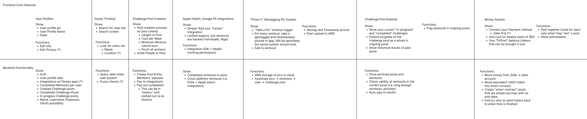

This is the FitCommit early React Native application for iOS and Android. This is designed to with thi following spec sheet in mind:

<div align="center">
    
</div>

This project is built with a [React Native](https://facebook.github.io/react-native/) boilerplate that can be used to kickstart a mobile application.

## Requirements

Node 12 or greater is required. Development for iOS requires a Mac and Xcode 10 or up, and will target iOS 11 and up.

You also need to install the dependencies required by React Native.  
Go to the [React Native environment setup](https://reactnative.dev/docs/environment-setup), then select `React Native CLI Quickstart` tab.  
Follow instructions for your given `development OS` and `target OS`.

## Quick start

To create a new project using the boilerplate simply run :

```
npx react-native init MyApp --template @thecodingmachine/react-native-boilerplate
```

Assuming you have all the requirements installed, you can run the project by running:

- `yarn start` to start the metro bundler, in a dedicated terminal
- `yarn <platform>` to run the *platform* application (remember to start a simulator or connect a device)

## License

This project is released under the [MIT License](LICENSE).